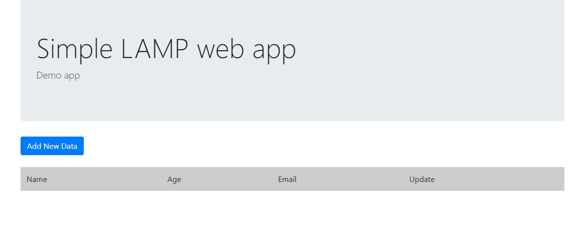

# Despliegue de una aplicación web LAMP sencilla

## Preparación del entorno
**1.** Elimina la carpeta ```/tmp/iaw-practica-lamp``` si existe para poder descargar una nueva copia
```
rm -rf /tmp/iaw-practica-lamp
```
**2.** Descarga el proyecto (nuestra aplicación) ```iaw-practica-lamp``` a la carpeta ```/tmp/iaw-practica-lamp``` desde el repositorio https://github.com/josejuansanchez/iaw-practica-lamp
```
git clone https://github.com/josejuansanchez/iaw-practica-lamp /tmp/iaw-practica-lamp
```
**3.** Copia el contenido de la carpeta ```src``` del repositorio que has clonado al directorio raíz ```var/www/html``` del servidor web Apache
```
mv /tmp/iaw-practica-lamp/src/* /var/www/html
```

## Configuración de una base de datos MySQL
**1.** Define en el archivo .env el nombre de la base de datos, el nombre de usuario que tendrá acceso a esta base de datos, y la contraseña para este usuario.
```
DB_NAME=ejemplo
DB_USER=usuario
DB_PASSWORD=pass
```
**2.** Elimina la base de datos, si existe
```
mysql -u root <<< "DROP DATABASE IF EXISTS $DB_NAME"
```
**3.** Crea una nueva base de datos con este nombre
```
mysql -u root <<< "CREATE DATABASE $DB_NAME"
```
**4.** Elimina el usuario de MySQL llamado DB_USER si existe
```
mysql -u root <<< "DROP USER IF EXISTS '$DB_USER'@'%'"
```
**5.** Crea un usuario con el nombre DB_USER y la contraseña DB_PASSWORD y le otorga todos los derechos sobre la base de datos creada
```
mysql -u root <<< "CREATE USER '$DB_USER'@'%' IDENTIFIED BY '$DB_PASSWORD'"
mysql -u root <<< "GRANT ALL PRIVILEGES ON $DB_NAME.* TO '$DB_USER'@'%'"
```
## Configuración de la conexión entre la aplicación y la base de datos
Usando utilita ```sed``` cambia el archivo ```cofig.php```, donde se encuentran parámetros de conexión a la base de datos, como el nombre de la base de datos, el nombre de usuario y la contraseña.
```
sed -i "s/database_name_here/$DB_NAME/" /var/www/html/config.php
sed -i "s/username_here/$DB_USER/" /var/www/html/config.php
sed -i "s/password_here/$DB_PASSWORD/" /var/www/html/config.php
```
## Configuración de la base de datos
**1.** Finalmente, actualiza el nombre de la base de datos en el archivo SQL ```database.sql```
```
sed -i "s/lamp_db/$DB_NAME/" /tmp/iaw-practica-lamp/db/database.sql
```
**2.** Carga datos iniciales y crea tablas en la base de datos con el comando
```
mysql -u root < /tmp/iaw-practica-lamp/db/database.sql
```
```mysql -u root```: inicia el cliente MySQL como usuario root
```< /tmp/iaw-practica-lamp/db/database.sql```: pasa el contenido del archivo database.sql y lo pasa al comando mysql

## Resultado
Ingresa la dirección IP de tu instancia en la barra de direcciones del navegador. Si todo se ha realizado correctamente, deberías ver esta página:

